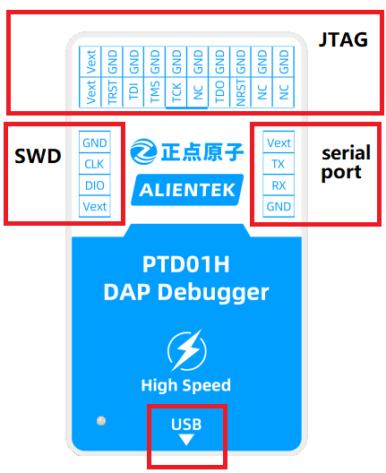
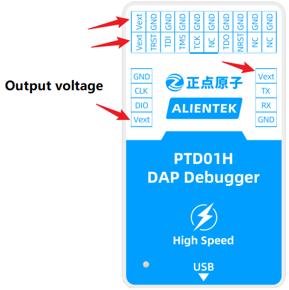
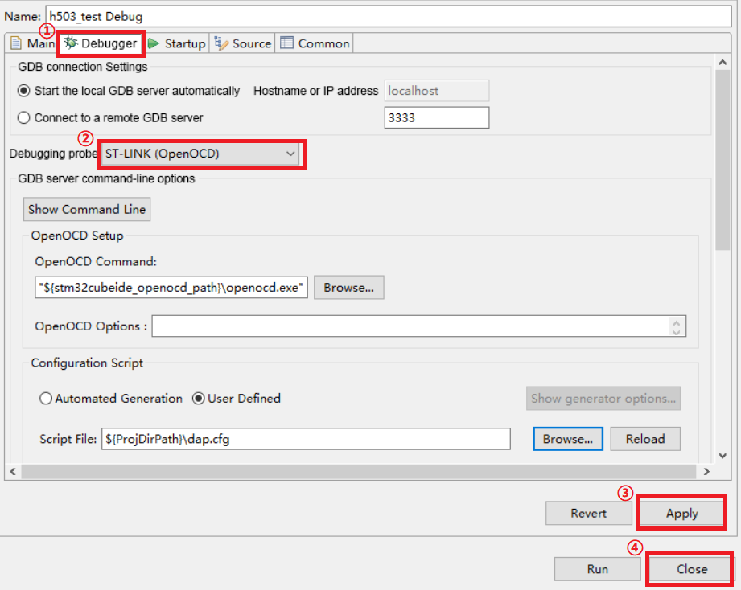

# 1 Introduction

## 1.1 Features
Here are the product features: 
+ Support **1.8V~5V** device, automatic detection
+ Support **1.8V/3.3V/5V** power output, set by the host computer
+ Support **MDK/STM32CubeIDE** compiler, no driver, no loss of firmware
+ Support ARM Cortex-M series core chips
+ Support simulation debugging, support code download, support virtual serial port
+ Provide 20P standard **JTAG** interface, provide 4P simplified **SWD** interface
+ Support **WIN7/WIN8/WIN10/WIN11** and other operating systems
+ Small size, easy to carry

## 1.2 Parameter

| Parameter                  | Describe                           |
| -------------------------- | ---------------------------------- |        
| Product model              | ATK-PTD01H                         |
| Serial speed               | 1Mbps(max)                         |
| Programmer speed           | 10M(max)                           |
| Working voltage            | 5V(Power supply with USB interface)|
| Working current            | 97mA                               |
| Temperature                | -40℃ ~ +85℃                      |
| Size                       | 66.5mm * 40mm * 17mm               |

## 1.3 Appearence

Output voltage, as shown below, all output voltage pins are connected.

# 2 Driver installation

### 2.1 Notes
1, WIN8 and above systems generally do not need to install drivers.
2, HID communication mode and WINUSB communication mode need to install different drivers

### 2.2 HID communication mode
For details, see the related instructions in [HID Serial Port Driver](./HID_serial_port_driver/HID_serial_port_driver_installation_tutorial.md) directory.

### 2.3 WINUSB communication mode
For details, see the description in the [WINUSB Driver](./WINUSB_driver/WINUSB_DAP_driver_installation_tutorial.md) directory.

# 3 STM32CubeIDE Configuration
Open STM32CubeIDE and double-click this file as shown below.

Make the following changes in the pop-up window. Remember not to save immediately after the changes, it is recommended to save as a "dap.cfg" file in the same directory.

Let's select the upper toolbar **run configurations**.

Double-click **h503_test** on the left, and select the appropriate option as labeled in the figure.

Click **Debugger** for configuration.

Click **Debugger** again and select the **dap.cfg** file we saved.

That's it for downloading and debugging.

## 3 Using
High-speed DAP is equipped with debugging serial port, which must be connected to VCC or set output voltage not 0V, and only 8 data bits are supported. Use the same as ordinary USB to serial port, **WIN7** needs to install the driver, WIN8 and above system generally will automatically install the driver.
After the correct drive, open the serial assistant to see the serial port. Refer to [Section 1.3](#13-appearence) for serial port pins.

[back to the top](#top)

