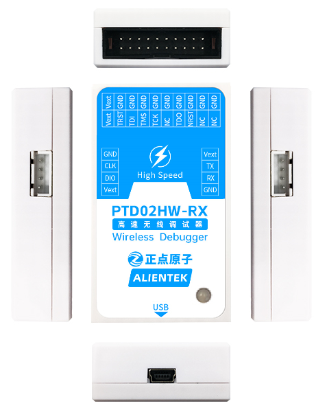

## Appearence

There are three accessories in total, one for the transmitter, one for the receiver, and one for the mini receiver.
The following figure shows the **transmitter** of the high-speed wireless debugger:

The following figure shows the **receiver** of the high-speed wireless debugger:

Below is the **mini receiver** of the high-speed wireless debugger.

## 1 Features

+ 2.4G wireless communication, automatic frequency hopping
+ Support 1.8V to 5V devices, automatic detection
+ Supports 1.8V/3.3V/5V power output, which needs to be set on the host, and does not support the small receive
+ Provide power support for the target board
+ Support ARM Cortex M0/M1/M3/M4/M7 whole series 
+ Support **MDK/STM32CubeIDE** and other IDE, no driver, no loss of firmware
+ Provide 20P standard **JTAG** interface, provide 4P simplified **SWD** interface
+ Support **WIN7/WIN8/WIN10/WIN11** and other operating systems
+ Small size, easy to carry
+ Download speed is fast

### 1.1 Parameter

| Parameter                         | Describe                           	 |
| ----------------------------------|----------------------------------- 	 |	        
| Product Model                     | ATK-PTD02HW                         	 |
| Simulation Interface              | JTAG,SWD                               | 
| Serial speed                      | 1Mbps(max)                             |
| Burning speed                     | 10M                                    |
| Communication distance     		| ≥10M 								 	 |
| TX operating voltage              | 5V (power by USB) 				 	 |
| TX operating current     		    | 151mA 						     	 |
| RX operating voltage              | 3.3V / 5V(power by USB or JTAG or SWD) |
| RX operating current      		| 132mA@5V 								 |
| RXmin operating voltage     	    | 3.3V / 5V(power by USB or JTAG or SWD) |
| RXmin operating current    	    | 60mA@5V 								 |
| Temperature                       | -40℃ ~ +85℃                          |
| Size                       		| 66.5mm * 40mm * 17mm               	 |
| RXmin size                        | 40mm * 20mm                            |

### 1.2 Connection

High-speed wireless debugger transmitter wiring.

High-speed wireless debugger receiver wiring. When using JTAG/SWD interface power supply.

High-speed wireless debugger receiver wiring. When using the USB interface power supply.

## 2 Driver installation
### 2.1 Notes

1, WIN8 and above systems generally do not need to install drivers.
2, HID communication mode and WINUSB communication mode need to install different drivers.

### 2.2 HID communication mode
For details, see the related instructions in [HID_Serial_Port_Driver](./HID_serial_port_driver/HID_serial_port_driver_installation_tutorial.md)directory.

### 2.3 WINUSB communication mode
For details, see the description in the [WINUSB_Driver](./WINUSB_driver/WINUSB_DAP_driver_installation_tutorial.md) directory.

## 3 STM32CubeIDE Configuration
Open STM32CubeIDE and double-click this file as shown below.

Make the following changes in the pop-up window. Remember not to save immediately after the changes, it is recommended to save as a "dap.cfg" file in the same directory.

Let's select the upper toolbar **run configurations**.

Double-click **f103_test** on the left, and select the appropriate option as labeled in the figure.

Click **Debugger** for configuration.

Click **Debugger** again and select the **dap.cfg** file we saved.

That's it for downloading and debugging.

## 4 Using
The High speed wireless DAP Debugger is configured with a debug serial port. It is used in the same way as the ordinary USB to serial port.WIN7 needs to install the driver, WIN8 and above system generally will automatically install the driver.
After the correct drive, open the serial assistant to see the serial port. 

