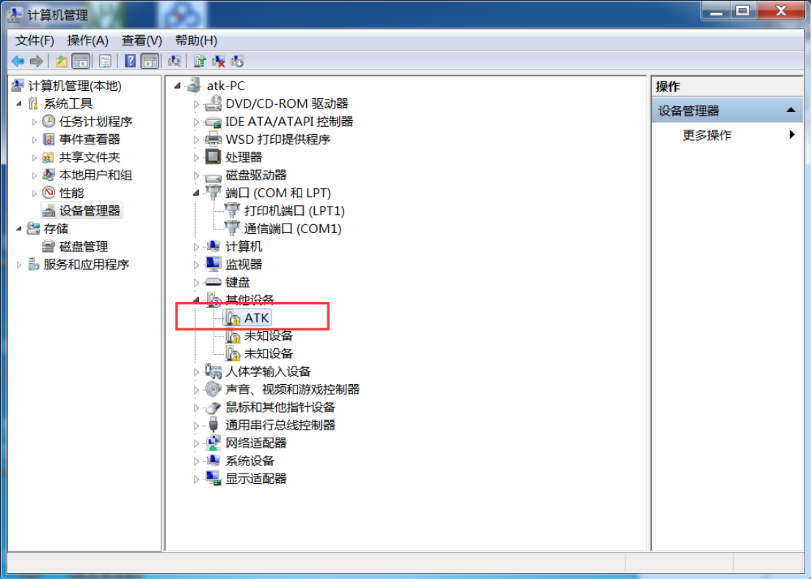
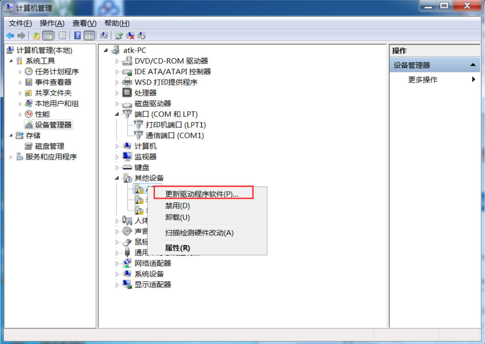
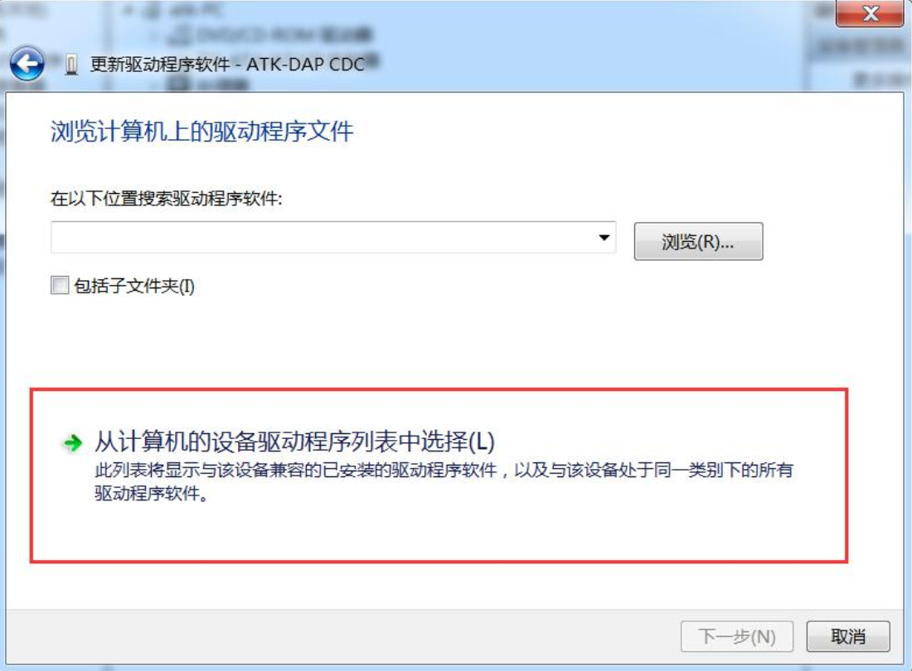
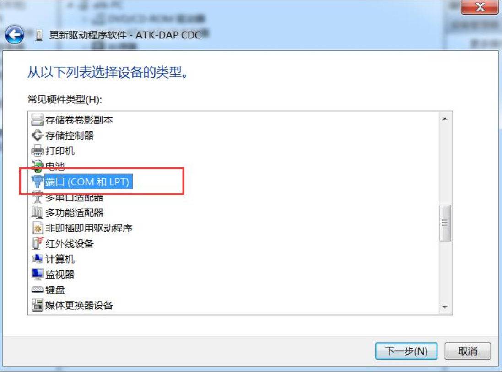
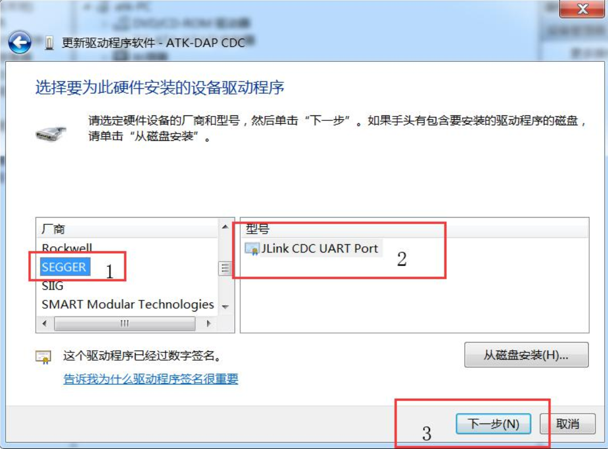
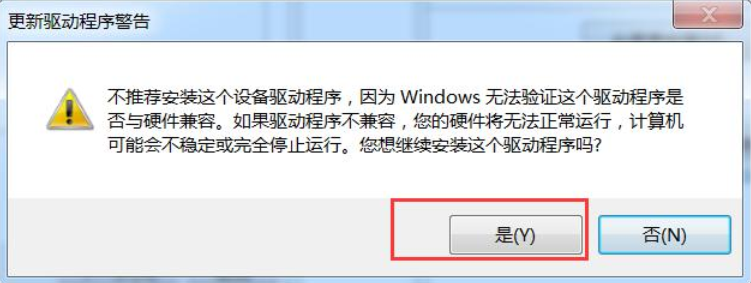
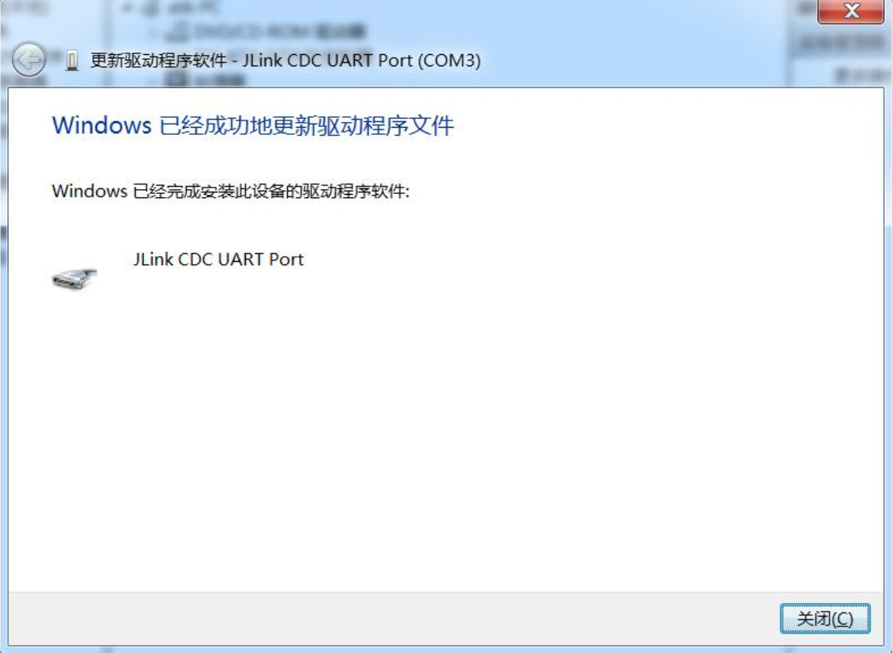

## Note
If the following steps fail to install the driver, install the jlink driver first and try again.

1 Open the Device Manager,as shown below.Select **ATK** in the **Other Devices** TAB.

2 Right click and select **Update the driver software**.

3 Then select **Browse Computer to find driver software**.

4 Then click the red box option **Select from the list of device drivers for your computer**.

5 Select **Port(COM and LPT)**.

6 Then, select the option in red box 1 and box 2, and finally click the **Next** button in red box 3.

7 Select the button in the red box in the image below.

8 Everything is fine as shown below.

[back to the top](#top)
