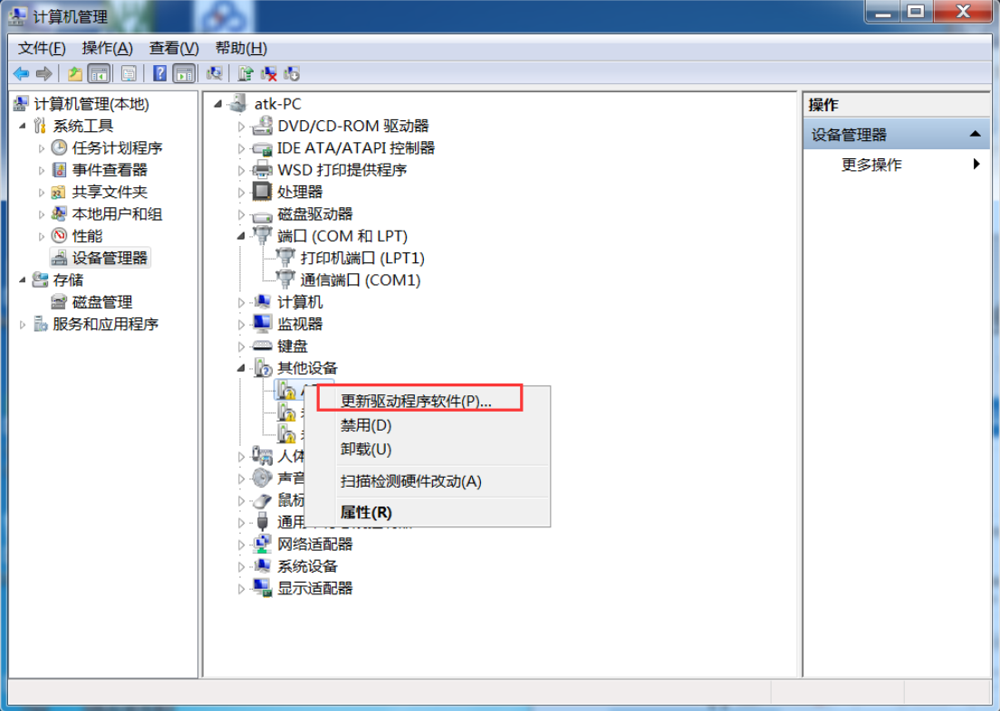
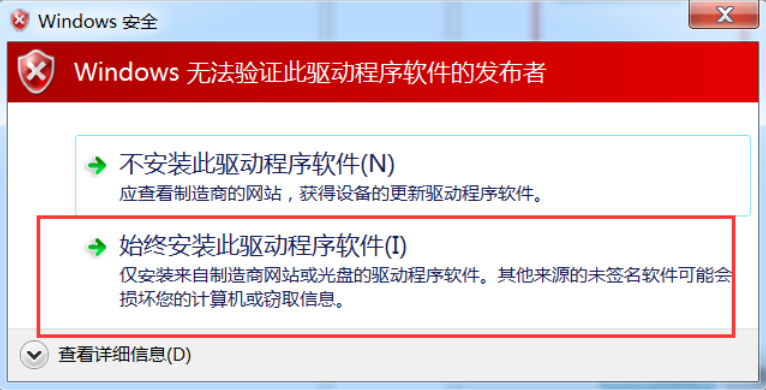

## Note
General win8 above the system, the network will automatically install the serial port driver, no special installation. Such as if the driver cannot be installed automatically, please follow the tutorial below to install the driver.

1 Open the Device Manager,as shown below.Select **ATK** in the **Other Devices** TAB.

2 Right click and select **Update the driver software**.

3 Then select **Browse Computer to find driver software**.

4 Then click the **Brows** button in red box 2, and find the **driver** in the "HID serial port driver" folder of the user profile.Folder, red box 1 is the corresponding folder, this directory can be different for each person. Finally, click **Next** in red box 3 Button.

5 Then, select the red box **Always install this driver software** entry as shown below.

6 Wait for a moment, everything is normal as shown below.

[back to the top](#top)