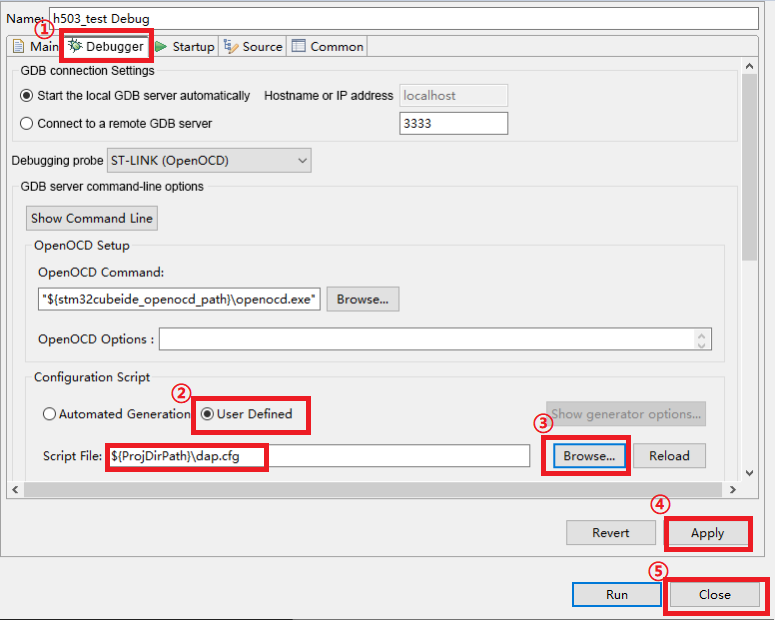

## Appearence

## Notes 

+ USB input voltage should not exceed **5.5V!**
+ Due to the limited output capacity of the USB interface, the USB connection may be unstable if the load is connected.

## 1 Parameter
Mini high speed DAP Debugger is one of the latest debuggers launched by ALIENTEK.
Real debugging tool, the product has the following features:
+ 3.3V devices are supported
+ Support **3.3V/5V** power output
+ Support **MDK/STM32CubeIDE** and other IDE, no driver, no loss of firmware
+ Support ARM Cortex-M series core chips
+ Provides the **SWD** interface
+ Support **WIN7/WIN8/WIN10/WIN11** and other operating systems
+ Small size, easy to carry
+ Download speed is fast

| Parameter                  | Describe                           |
| -------------------------- | ---------------------------------- |        
| Product model              | ATK-PTD01MH                        |
| Serial speed               | 1Mbps(max)                         |
| Programmer speed           | 10M(max)                           |
| Working voltage            | 5V(Power supply with USB interface)|
| Working current            | 38mA                               |
| Size                       | 53.8mm * 20mm * 9.5mm              |

## 2 QuickStart

### 2.1 Driver installation

#### 2.1.1 Notes
1, WIN8 and above systems generally do not need to install drivers.
2, HID communication mode and WINUSB communication mode need to install different drivers

#### 2.1.2 HID communication mode
For details, see the related instructions in [HID_Serial_Port_Driver](./HID_serial_port_driver/HID_serial_port_driver_installation_tutorial.md)directory.

#### 2.1.3 WINUSB communication mode
For details, see the description in the [WINUSB_Driver](./WINUSB_driver/WINUSB_DAP_driver_installation_tutorial.md) directory.

### 2.2 STM32CubeIDE Configuration
Open STM32CubeIDE and double-click this file as shown below.

Make the following changes in the pop-up window. Remember not to save immediately after the changes, it is recommended to save as a "dap.cfg" file in the same directory.

Let's select the upper toolbar **run configurations**.

Double-click **h503_test** on the left, and select the appropriate option as labeled in the figure.

Click **Debugger** for configuration.

Click **Debugger** again and select the **dap.cfg** file we saved.

That's it for downloading and debugging.

## 3 Using
The Mini high-speed DAP is configured with a debug serial port and supports only 8-bit data bits. It is used in the same way as the ordinary USB to serial port.
WIN7 needs to install the driver, WIN8 and above system generally will automatically install the driver.
After the correct drive, open the serial assistant to see the serial port. Refer to [Section 2.1](#21-appearence) for serial port pins.

[back to the top](#top)

