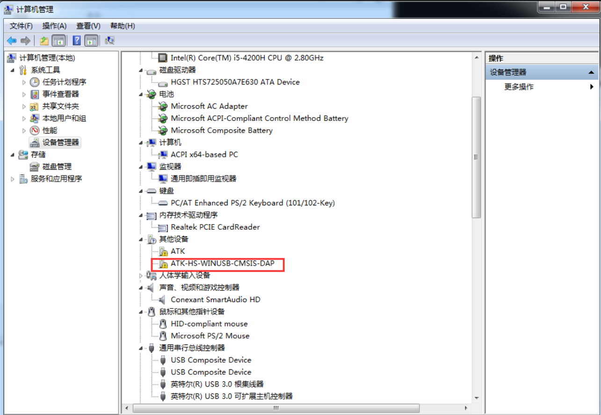
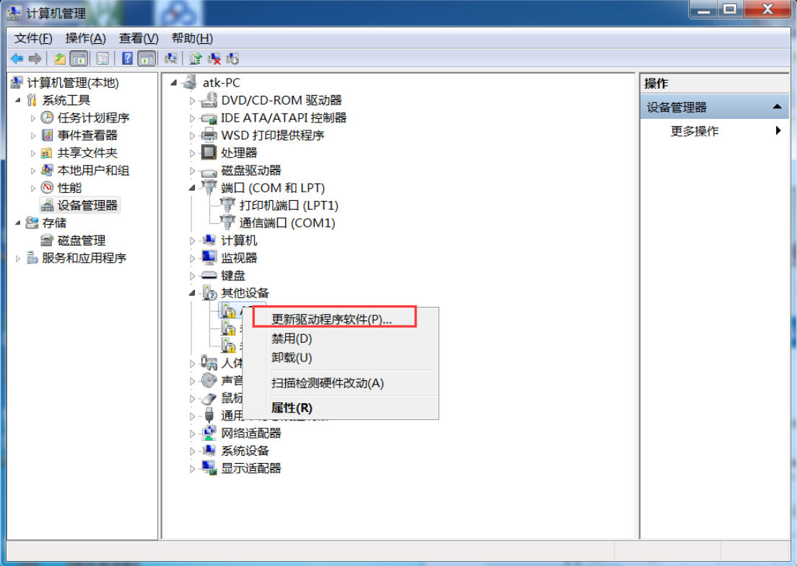
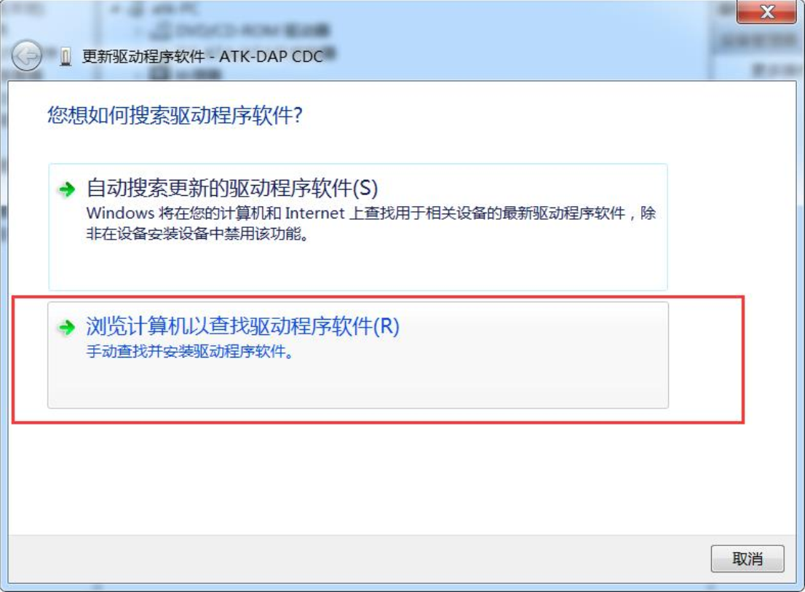
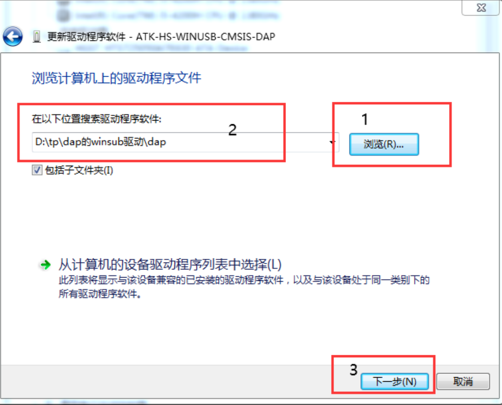
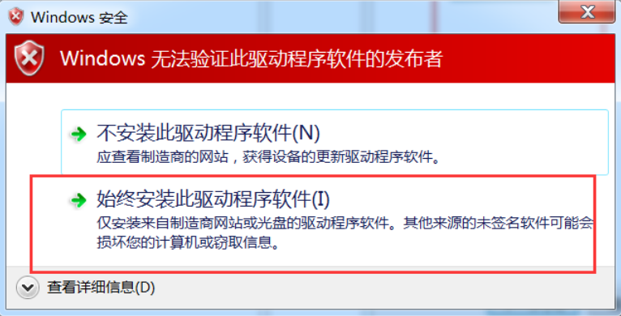
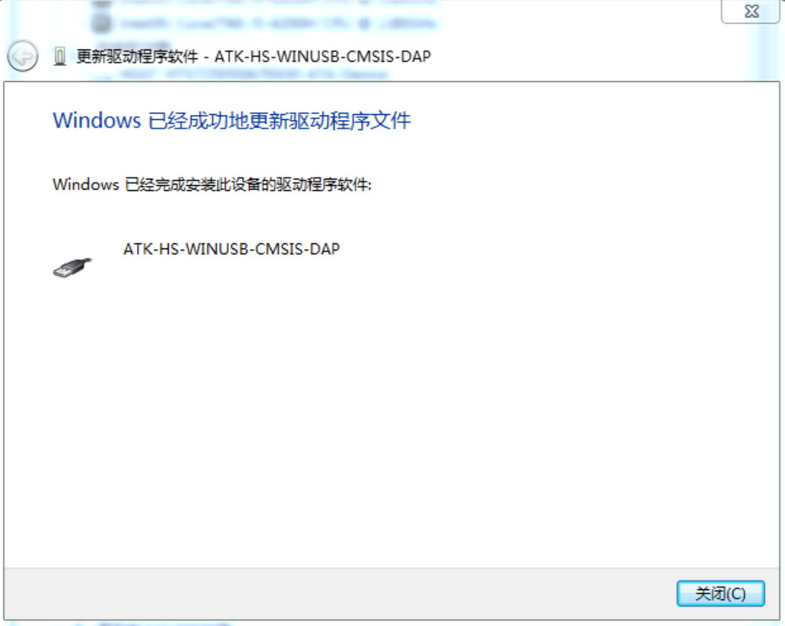

## Note
General win8 or above system, the network will automatically install the driver, no special installation.

1 Open the Device Manager,as shown below.Select **ATK-HS-WINUSB-CMSIS-DAP** in the **Other Devices** TAB.

2 Right click and select **Update the driver software**.

3 Then select **Browse Computer to find driver software**.

4 Then click the **Browse** button in the red box 1 to find the **dap** text in the "WINUSB driver" folder of the user's profile Folder, red box 2 is the corresponding folder, this directory can be different for each person. Finally, click **Next** in red box 3 Button.

5 Then, select the red box **Always install this driver software** entry as shown below.

6 Wait for a moment, everything is normal as shown below.

[back to the top](#top)